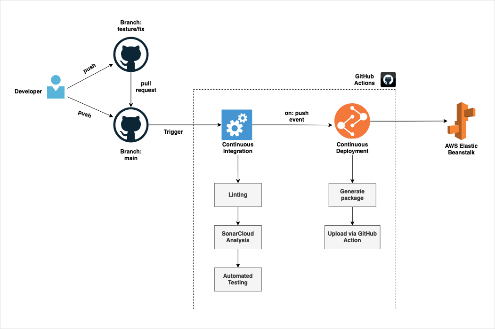

# Face The Facts

[Face The Facts](https://facethefacts.app/) is an open-source project that develops a mobile app to show politicians' information by scanning their election posters with a smartphone. Our mission is to make politicians' information (e.g., their past voting behaviours and CVs) more accessible and to encourage users to vote critically.
In our project, we focus on the German election system. With our architecture, you can build a Face The Facts app for a different country.
This backend repository includes codes to scrape politicians' data, set up a database, and create our APIs.
## Software Architecture


## Environment Variables

To run this project, you will need to add the following environment variables to your .env file

`DATABASE_HOST`

`DATABASE_USER`

`DATABASE_PASSWORD`

`DATABASE_NAME`
## Installation/ Run locally

We are using [poetry](https://python-poetry.org/) dependency management and packaging in Python. In addition, we take advantage of [uvicorn](https://www.uvicorn.org/) to implement a server. For setting up, run these commands as follows.

One time
- Install Python 3.8≤
- Install [poetry](https://python-poetry.org/docs/#installation)

Every time
```bash
  # Create a virtual environment
  $ poetry shell
  # Install all packages
  $ poetry install
  # Start API server on port = 8000
  $ uvicorn src.api.main:app --reload
```
    
## API
The APIs are set up in the src/api directory with [FastAPI](https://fastapi.tiangolo.com/). main.py file includes definitions of all routes, and schemas.py has models for return values. In addition, queries in crud.py can retrieve data.
Users can check our routes locally by executing main.py with uvicorn and see the remote APIs document/reference [here](https://api.facethefacts-api.de/docs).
## Database
Our team utilises [Amazon RDS for PostgreSQL](https://aws.amazon.com/rds/postgresql/) as a database and [SQLAlchemy](https://www.sqlalchemy.org/) as Object Relational Mapper and defines database connection in the src/db/connection.py.

Inside the src/db, our team defines data models and creates a migration environment with [Alembic](https://alembic.sqlalchemy.org/en/latest/). Our Entity-Relationship diagram is as follows.


For scheduled database tasks, functions under the src/cron-jobs directory handle them. For instance, our team updates the vote table by executing the append_polls function in the append_db.py once a week.

## Scraping/ Datasource
The programme collects data in two ways. Functions in src/cron-jobs retrieve third-party APIs (e.g., [abgeordnetenwatch.de API](https://www.abgeordnetenwatch.de/api)) from our partners and store them in our database. In addition, programmes in the src/scraper directory scrape websites with [Scrapy](https://scrapy.org/) to compensate lack of political data. 
Our team defines classes to scrape information from a website under the src/data-scraper/spiders directory. For instance, if users execute functions in the directory, it generates a JSON file with the scraped information (e.g., python -m src/data-scraper/profile:generates profile.json). src/data-scraper directory also includes helper functions under the utils directory.
## Continuous Integration/Deployment
This repository includes an automatic CI/CD pipeline for checking the respective push/pull-request event and in case of code is merged or pushed into the `main` branch, it automatically triggers a deployment to AWS Elastic Beanstalk. A ruff overview of this flow can be found in the diagram below:

## Automated Testing
Our git workflow assesses functions with [pytest](https://docs.pytest.org/en/6.2.x/). Tests directory defines all tests by following the same structure in the src directory. Every time users merge branches, .github/workflows/ci.yml file detects errors in codes.
