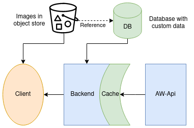

# face the backend

- [overview](#overview)
- [setup](#setup)
  - [one time](#one-time)
  - [every time](#every-time)
- [container](#container)

## overview

  
_Fig. 1: Architectural overview_

## setup

### one time

* have `python 3.9` installed
* have `poetry` installed: https://python-poetry.org/docs/#installation

### every time

* `poetry shell`: (create and) enter virtual environment
* `poetry install`: install dependencies
* `uvicorn main:app --reload`: start development server

## container

_(you can replace `podman` with `docker` in most cases)_

* `podman build -t ftf-backend .`: build the container image
